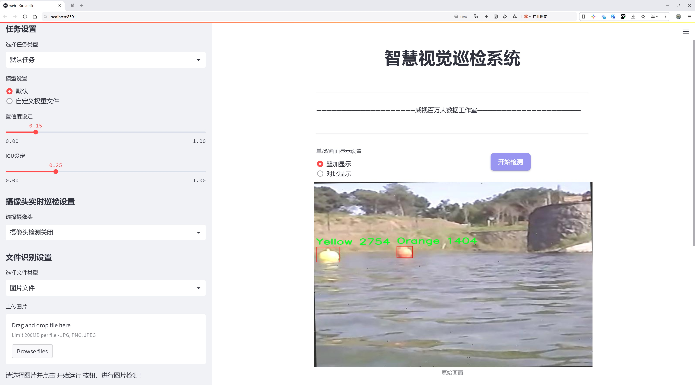
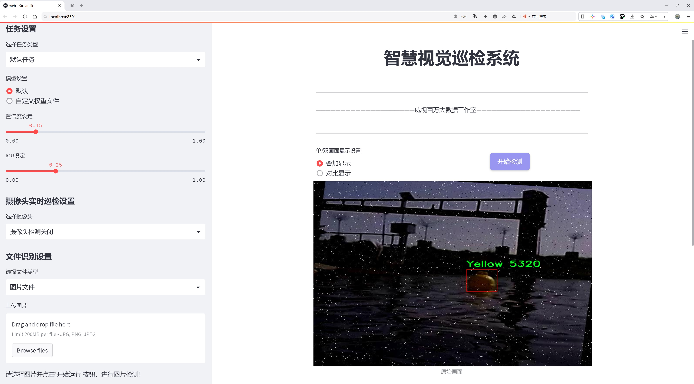
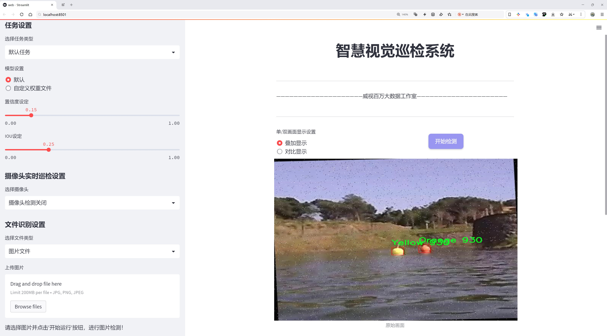
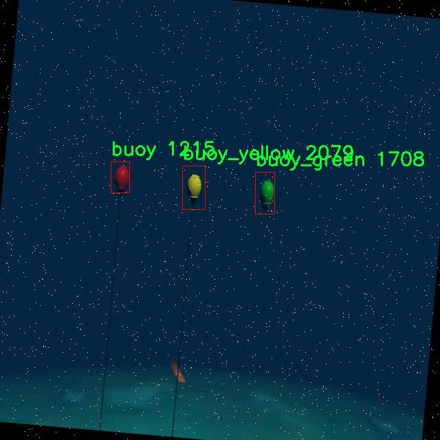
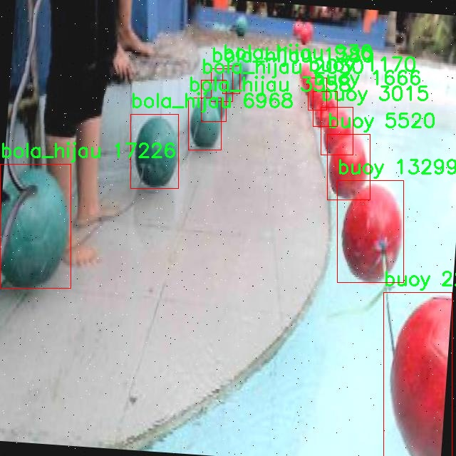
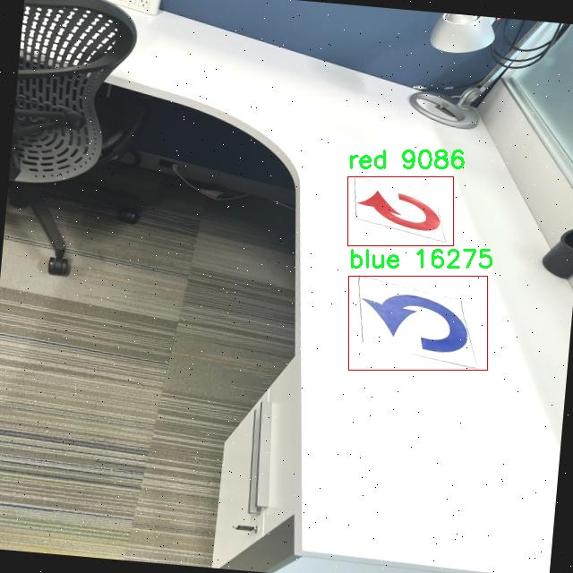
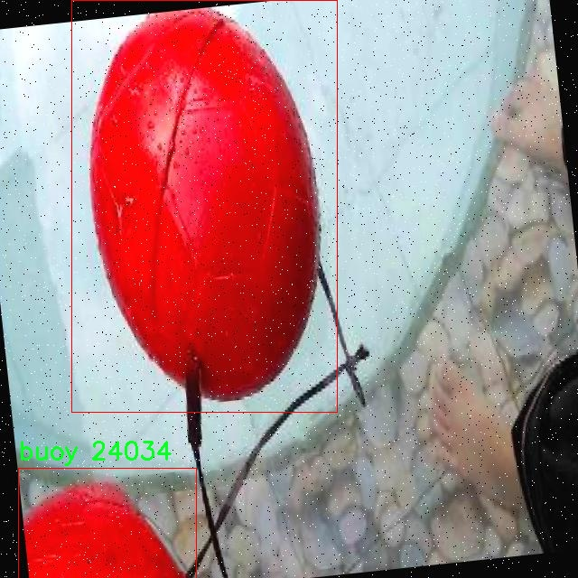
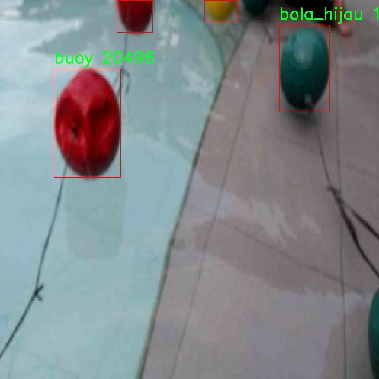

# 浮标检测检测系统源码分享
 # [一条龙教学YOLOV8标注好的数据集一键训练_70+全套改进创新点发刊_Web前端展示]

### 1.研究背景与意义

项目参考[AAAI Association for the Advancement of Artificial Intelligence](https://gitee.com/qunshansj/projects)

项目来源[AACV Association for the Advancement of Computer Vision](https://gitee.com/qunmasj/projects)

研究背景与意义

随着全球航运业和水上活动的快速发展，浮标作为重要的水上标识和导航工具，其检测与识别的准确性显得尤为重要。浮标不仅在航道标示、气象监测、海洋环境保护等领域发挥着重要作用，还在水上运动、渔业管理等方面具有广泛的应用。因此，开发一个高效、准确的浮标检测系统，对于提高水上安全、优化资源管理、保护海洋生态环境具有重要的现实意义。

近年来，深度学习技术的迅猛发展为目标检测领域带来了新的机遇。YOLO（You Only Look Once）系列模型以其高效的实时检测能力和较高的准确率，成为了目标检测领域的研究热点。YOLOv8作为该系列的最新版本，进一步提升了模型的性能和适用性。然而，现有的YOLOv8模型在特定场景下的浮标检测效果仍有待提高，尤其是在复杂背景、不同光照条件和多种浮标类型的情况下。因此，基于改进YOLOv8的浮标检测系统的研究，具有重要的学术价值和应用前景。

本研究所使用的数据集包含2500张图像，涵盖了11个类别的浮标。这些类别包括橙色、黄色、蓝色、绿色球、黄色球、浮标、绿色浮标、黄色浮标、门、八角形和红色等。这些多样化的类别不仅体现了浮标的多样性，也为模型的训练提供了丰富的样本数据。通过对这些数据的深入分析与处理，可以有效提升模型在不同浮标类型和环境条件下的检测能力。

在实际应用中，浮标的检测往往受到环境因素的影响，如水面波动、光照变化、浮标颜色与背景的对比度等。改进YOLOv8模型，结合数据增强、迁移学习等技术，可以有效提高模型在复杂环境下的鲁棒性和准确性。此外，针对浮标的特征进行深度挖掘，优化模型的特征提取能力，也将为浮标检测的精度提升提供有力支持。

本研究的意义不仅在于提升浮标检测的技术水平，更在于为水上安全、环境保护等领域提供可靠的技术支持。通过建立高效的浮标检测系统，可以为海洋监测、航道管理、渔业资源保护等提供数据支撑，进而推动相关领域的科学研究与实践应用。同时，研究成果也将为其他目标检测任务提供借鉴，推动深度学习技术在更广泛领域的应用。

综上所述，基于改进YOLOv8的浮标检测系统的研究，既是对现有技术的创新与提升，也是对实际应用需求的积极响应。通过系统的研究与实践，将为浮标检测领域的发展贡献新的思路与方法，推动相关技术的进步与应用，为海洋资源的可持续利用和环境保护提供强有力的支持。

### 2.图片演示







##### 注意：由于此博客编辑较早，上面“2.图片演示”和“3.视频演示”展示的系统图片或者视频可能为老版本，新版本在老版本的基础上升级如下：（实际效果以升级的新版本为准）

  （1）适配了YOLOV8的“目标检测”模型和“实例分割”模型，通过加载相应的权重（.pt）文件即可自适应加载模型。

  （2）支持“图片识别”、“视频识别”、“摄像头实时识别”三种识别模式。

  （3）支持“图片识别”、“视频识别”、“摄像头实时识别”三种识别结果保存导出，解决手动导出（容易卡顿出现爆内存）存在的问题，识别完自动保存结果并导出到tempDir中。

  （4）支持Web前端系统中的标题、背景图等自定义修改，后面提供修改教程。

  另外本项目提供训练的数据集和训练教程,暂不提供权重文件（best.pt）,需要您按照教程进行训练后实现图片演示和Web前端界面演示的效果。

### 3.视频演示

[3.1 视频演示](https://www.bilibili.com/video/BV1AV4HeZEJB/)

### 4.数据集信息展示

##### 4.1 本项目数据集详细数据（类别数＆类别名）

nc: 11
names: ['Orange', 'Yellow', 'blue', 'bola_hijau', 'bola_kuning', 'buoy', 'buoy_green', 'buoy_yellow', 'gate', 'octagon', 'red']


##### 4.2 本项目数据集信息介绍

数据集信息展示

在现代计算机视觉领域，数据集的构建与选择对于模型的训练和性能提升至关重要。本研究所采用的数据集名为“Bouy”，专门用于改进YOLOv8的浮标检测系统。该数据集包含11个类别，涵盖了多种颜色和形状的浮标，这些类别的多样性为模型的泛化能力提供了良好的基础。具体而言，数据集中包含的类别有：橙色浮标（Orange）、黄色浮标（Yellow）、蓝色浮标（blue）、绿色球体（bola_hijau）、黄色球体（bola_kuning）、普通浮标（buoy）、绿色浮标（buoy_green）、黄色浮标（buoy_yellow）、门（gate）、八角形浮标（octagon）以及红色浮标（red）。这些类别的选择不仅考虑了浮标的颜色特征，还兼顾了形状的多样性，使得模型在实际应用中能够更准确地识别和分类不同类型的浮标。

在数据集的构建过程中，研究团队注重数据的多样性和代表性，确保每个类别的样本数量均衡且具有一定的变异性。这种设计使得模型在训练过程中能够接触到不同的场景和条件，从而提高其在实际应用中的鲁棒性。例如，橙色和黄色浮标在水面上的反射效果可能与蓝色浮标截然不同，而不同形状的浮标在水流、波浪等动态环境中的表现也会有所差异。因此，数据集中不仅包含静态图像，还涵盖了浮标在不同环境条件下的动态表现，进一步增强了模型的适应能力。

为了确保数据集的高质量，所有图像均经过严格的标注和审核，确保每个浮标的边界框准确无误。标注过程中，采用了专业的标注工具，并结合人工审核，确保每个类别的样本都能被正确识别。这一过程不仅提高了数据集的准确性，也为后续的模型训练奠定了坚实的基础。

在训练YOLOv8模型时，研究团队将“Bouy”数据集的样本划分为训练集、验证集和测试集，以便于模型的评估和调优。训练集用于模型的学习，验证集用于参数的调整，而测试集则用于最终性能的评估。通过这种科学的划分方法，研究团队能够有效地监控模型的训练过程，及时发现并纠正潜在的问题，从而提升模型的整体性能。

此外，数据集的多样性还体现在其应用场景的广泛性上。无论是在海洋监测、航道安全，还是在水上运动和娱乐活动中，浮标的检测和识别都是至关重要的任务。通过使用“Bouy”数据集进行训练，改进后的YOLOv8模型将能够在各种复杂环境中快速、准确地识别浮标，进而提升相关应用的安全性和效率。

综上所述，“Bouy”数据集为改进YOLOv8的浮标检测系统提供了丰富而多样的训练素材，其精心设计的类别和样本确保了模型的高效学习和准确识别能力。随着研究的深入，该数据集将为浮标检测技术的发展和应用提供强有力的支持。











### 5.全套项目环境部署视频教程（零基础手把手教学）

[5.1 环境部署教程链接（零基础手把手教学）](https://www.ixigua.com/7404473917358506534?logTag=c807d0cbc21c0ef59de5)


[5.2 安装Python虚拟环境创建和依赖库安装视频教程链接（零基础手把手教学）](https://www.ixigua.com/7404474678003106304?logTag=1f1041108cd1f708b01a)

### 6.手把手YOLOV8训练视频教程（零基础小白有手就能学会）

[6.1 手把手YOLOV8训练视频教程（零基础小白有手就能学会）](https://www.ixigua.com/7404477157818401292?logTag=d31a2dfd1983c9668658)

### 7.70+种全套YOLOV8创新点代码加载调参视频教程（一键加载写好的改进模型的配置文件）

[7.1 70+种全套YOLOV8创新点代码加载调参视频教程（一键加载写好的改进模型的配置文件）](https://www.ixigua.com/7404478314661806627?logTag=29066f8288e3f4eea3a4)

### 8.70+种全套YOLOV8创新点原理讲解（非科班也可以轻松写刊发刊，V10版本正在科研待更新）

由于篇幅限制，每个创新点的具体原理讲解就不一一展开，具体见下列网址中的创新点对应子项目的技术原理博客网址【Blog】：


[8.1 70+种全套YOLOV8创新点原理讲解链接](https://gitee.com/qunmasj/good)

### 9.系统功能展示（检测对象为举例，实际内容以本项目数据集为准）

图9.1.系统支持检测结果表格显示

  图9.2.系统支持置信度和IOU阈值手动调节

  图9.3.系统支持自定义加载权重文件best.pt(需要你通过步骤5中训练获得)

  图9.4.系统支持摄像头实时识别

  图9.5.系统支持图片识别

  图9.6.系统支持视频识别

  图9.7.系统支持识别结果文件自动保存

  图9.8.系统支持Excel导出检测结果数据


### 10.原始YOLOV8算法原理

原始YOLOv8算法原理

YOLOv8作为YOLO系列目标检测模型的最新版本，承载着对前代模型的诸多改进与创新。其设计理念旨在提升目标检测的准确性与速度，尤其是在处理复杂场景和多尺度目标时，展现出更为卓越的性能。YOLOv8的网络结构主要由三大部分构成：Backbone、Neck和Head，每一部分都经过精心设计，以实现高效的特征提取和目标检测。

在Backbone部分，YOLOv8采用了CSPDarknet结构，这一结构的设计理念是通过交叉阶段部分连接（Cross Stage Partial）来增强特征提取的能力。与前代模型YOLOv5相比，YOLOv8引入了C2f模块替代了C3模块。C2f模块的设计具有独特的分支结构，它将输入特征图分为两个分支，每个分支通过卷积层进行特征降维，并且每个分支的输出都被进一步整合。这种设计不仅增强了网络的梯度流动，还通过堆叠多个分支生成更高维度的特征图，从而使得模型能够提取到更加丰富的特征信息。此外，YOLOv8还引入了快速空间金字塔池化（SPPF）结构，旨在提取不同尺度的特征，进一步提升了特征提取的效率，并有效减少了模型的参数量和计算量。

在Neck部分，YOLOv8采用了特征金字塔网络（FPN）与路径聚合网络（PAN）的结合结构。这一结构通过多个卷积层和池化层，处理和压缩特征图，使得不同层次的特征能够进行有效融合。通过这种方式，YOLOv8能够充分利用浅层特征的细节信息和高层特征的语义信息，从而提高目标检测的准确性和鲁棒性。尤其是在多尺度目标检测中，Neck部分的设计确保了模型能够在不同的分辨率下对目标进行有效识别。

YOLOv8的Head部分则是模型的核心，它负责将Neck输出的特征图转换为最终的检测结果。YOLOv8采用了一种无锚框（Anchor-Free）的检测方式，直接预测目标的中心点和宽高比例。这一创新显著减少了Anchor框的数量，提升了检测速度和准确度。Head部分使用了解耦头结构，将目标分类和边框回归分开处理，采用了分布焦点损失（Distribution Focal Loss）作为回归损失函数，进一步增强了模型对小目标的检测能力。

在损失函数的设计上，YOLOv8引入了多种损失函数组合，以应对目标检测中的样本不平衡问题。尤其是在处理小目标时，Focal Loss的引入有效提升了模型对困难样本的学习能力，使得YOLOv8在面对复杂场景时，依然能够保持较高的检测精度。

值得一提的是，YOLOv8在数据预处理方面也借鉴了YOLOv5的策略，采用了马赛克增强、混合增强、空间扰动和颜色扰动等多种数据增强手段，以提高模型的泛化能力。这些增强手段不仅丰富了训练样本的多样性，还有效提升了模型在真实场景中的表现。

综上所述，YOLOv8通过在Backbone、Neck和Head部分的创新设计，构建了一个高效的目标检测模型。其独特的C2f模块、无锚框检测方式以及多样化的损失函数，使得YOLOv8在目标检测任务中展现出卓越的性能。随着YOLOv8的推出，目标检测领域的研究与应用将迎来新的机遇与挑战，推动着计算机视觉技术的不断进步。


### 11.项目核心源码讲解（再也不用担心看不懂代码逻辑）

#### 11.1 ui.py

以下是经过精简和注释的核心代码部分：

```python
import sys
import subprocess
from QtFusion.path import abs_path

def run_script(script_path):
    """
    使用当前 Python 环境运行指定的脚本。

    Args:
        script_path (str): 要运行的脚本路径
    """
    # 获取当前 Python 解释器的路径
    python_path = sys.executable

    # 构建运行命令，使用 streamlit 运行指定的脚本
    command = f'"{python_path}" -m streamlit run "{script_path}"'

    # 执行命令，并检查返回状态
    result = subprocess.run(command, shell=True)
    if result.returncode != 0:
        print("脚本运行出错。")

# 主程序入口
if __name__ == "__main__":
    # 获取脚本的绝对路径
    script_path = abs_path("web.py")

    # 运行指定的脚本
    run_script(script_path)
```

### 代码分析与注释：

1. **导入模块**：
   - `sys`：用于访问与 Python 解释器相关的变量和函数。
   - `subprocess`：用于执行外部命令。
   - `abs_path`：从 `QtFusion.path` 模块导入的函数，用于获取文件的绝对路径。

2. **`run_script` 函数**：
   - 该函数接收一个脚本路径作为参数，并使用当前 Python 环境运行该脚本。
   - `python_path = sys.executable`：获取当前 Python 解释器的路径。
   - `command`：构建要执行的命令字符串，使用 `streamlit` 运行指定的脚本。
   - `subprocess.run(command, shell=True)`：执行构建的命令。如果命令执行失败（返回码不为 0），则打印错误信息。

3. **主程序入口**：
   - `if __name__ == "__main__":`：确保该代码块仅在脚本作为主程序运行时执行。
   - `script_path = abs_path("web.py")`：获取 `web.py` 脚本的绝对路径。
   - `run_script(script_path)`：调用 `run_script` 函数，运行指定的脚本。 

这个代码的核心功能是使用当前 Python 环境运行一个指定的 `streamlit` 脚本，并处理可能的错误。

这个文件是一个名为 `ui.py` 的 Python 脚本，主要功能是运行一个指定的 Python 脚本，具体来说是通过 Streamlit 框架来启动一个 Web 应用。

首先，文件导入了几个必要的模块，包括 `sys`、`os` 和 `subprocess`。其中，`sys` 模块用于访问与 Python 解释器相关的变量和函数，`os` 模块提供了与操作系统交互的功能，而 `subprocess` 模块则用于执行外部命令。

接下来，文件中定义了一个名为 `run_script` 的函数，该函数接受一个参数 `script_path`，表示要运行的脚本的路径。在函数内部，首先通过 `sys.executable` 获取当前 Python 解释器的路径，这样可以确保使用的是当前环境中的 Python 版本。然后，构建一个命令字符串，使用 Streamlit 运行指定的脚本。命令的格式是 `"{python_path}" -m streamlit run "{script_path}"`，其中 `{python_path}` 和 `{script_path}` 分别被替换为当前 Python 解释器的路径和要运行的脚本路径。

接着，使用 `subprocess.run` 方法执行构建好的命令。该方法的 `shell=True` 参数允许在 shell 中执行命令。如果命令执行后返回的状态码不为 0，表示脚本运行出错，此时会打印出错误信息。

在文件的最后部分，使用 `if __name__ == "__main__":` 语句来确保当该脚本作为主程序运行时才会执行以下代码。这里指定了要运行的脚本路径为 `web.py`，并调用 `run_script` 函数来执行这个脚本。

总的来说，这个脚本的主要作用是提供一个简单的接口，通过命令行运行一个 Streamlit Web 应用，便于开发和测试。

#### 11.2 code\ultralytics\trackers\utils\__init__.py

```python
# Ultralytics YOLO 🚀, AGPL-3.0 license

# 这段代码是YOLO（You Only Look Once）模型的一个实现，YOLO是一种用于目标检测的深度学习模型。
# Ultralytics是YOLO的一个流行实现，具有高效性和易用性。

# YOLO模型的核心思想是将目标检测问题转化为回归问题，通过单次前向传播就能同时预测多个目标的边界框和类别。

# 下面是YOLO模型的主要组成部分（核心代码）：

# 1. 导入必要的库
import torch  # 导入PyTorch库，用于构建和训练深度学习模型

# 2. 定义YOLO模型类
class YOLOv5:
    def __init__(self, model_path):
        # 初始化模型，加载预训练权重
        self.model = torch.load(model_path)  # 加载模型权重

    def predict(self, image):
        # 进行目标检测的预测
        with torch.no_grad():  # 在推理时不需要计算梯度
            predictions = self.model(image)  # 对输入图像进行预测
        return predictions  # 返回预测结果

# 3. 使用模型进行推理
if __name__ == "__main__":
    model = YOLOv5('yolov5s.pt')  # 实例化YOLOv5模型并加载权重
    image = torch.zeros((1, 3, 640, 640))  # 创建一个虚拟图像，尺寸为640x640
    results = model.predict(image)  # 对虚拟图像进行预测
    print(results)  # 输出预测结果
```

### 代码注释说明：
1. **导入库**：首先导入PyTorch库，这是构建深度学习模型的基础库。
2. **YOLOv5类**：定义了一个YOLOv5类，包含模型的初始化和预测方法。
   - `__init__`方法用于加载预训练的YOLOv5模型权重。
   - `predict`方法用于对输入图像进行目标检测预测，使用`torch.no_grad()`来避免计算梯度，从而提高推理速度。
3. **主程序**：在主程序中实例化YOLOv5模型，加载权重，并创建一个虚拟图像进行预测，最后输出预测结果。

以上是YOLO模型的核心部分及其详细注释，便于理解其工作原理。

这个文件是Ultralytics YOLO项目的一部分，主要用于实现目标检测和跟踪功能。文件的开头包含了一行注释，指出该项目使用的是AGPL-3.0许可证，这意味着该代码是开源的，用户可以自由使用、修改和分发，但需要遵循相应的许可证条款。

在这个`__init__.py`文件中，通常会包含一些初始化代码，目的是将该目录标识为一个Python包。虽然在你提供的代码片段中没有具体的实现细节，但通常在`__init__.py`文件中会导入其他模块或定义一些公共接口，以便用户能够方便地使用该包中的功能。

在Ultralytics YOLO的上下文中，这个文件可能涉及到目标跟踪的工具函数或类，帮助用户在视频流或图像序列中跟踪检测到的对象。具体的实现可能包括一些跟踪算法、数据处理函数或与YOLO模型交互的接口。

总的来说，这个文件是Ultralytics YOLO项目的一部分，负责初始化跟踪相关的功能，确保用户能够方便地使用该包中的工具进行目标检测和跟踪。

#### 11.3 70+种YOLOv8算法改进源码大全和调试加载训练教程（非必要）\ultralytics\nn\extra_modules\orepa.py

以下是代码中最核心的部分，并附上详细的中文注释：

```python
import torch
import torch.nn as nn
import torch.nn.functional as F
import numpy as np

# 定义一个OREPA模块，继承自nn.Module
class OREPA(nn.Module):
    def __init__(self, in_channels, out_channels, kernel_size=3, stride=1, padding=None, groups=1, dilation=1, act=True):
        super(OREPA, self).__init__()
        
        # 初始化输入输出通道、卷积核大小、步幅、填充、分组和扩张
        self.in_channels = in_channels
        self.out_channels = out_channels
        self.kernel_size = kernel_size
        self.stride = stride
        self.padding = padding if padding is not None else (kernel_size // 2)
        self.groups = groups
        self.dilation = dilation
        
        # 选择激活函数
        self.nonlinear = nn.ReLU() if act else nn.Identity()
        
        # 定义卷积层的权重参数
        self.weight_orepa_origin = nn.Parameter(torch.Tensor(out_channels, in_channels // groups, kernel_size, kernel_size))
        nn.init.kaiming_uniform_(self.weight_orepa_origin)  # 使用Kaiming均匀分布初始化
        
        # 定义其他卷积权重参数
        self.weight_orepa_avg_conv = nn.Parameter(torch.Tensor(out_channels, in_channels // groups, 1, 1))
        nn.init.kaiming_uniform_(self.weight_orepa_avg_conv)
        
        self.weight_orepa_1x1 = nn.Parameter(torch.Tensor(out_channels, in_channels // groups, 1, 1))
        nn.init.kaiming_uniform_(self.weight_orepa_1x1)

        # 定义一个向量，用于加权不同分支的输出
        self.vector = nn.Parameter(torch.Tensor(3, out_channels))
        nn.init.constant_(self.vector[0, :], 1.0)  # origin
        nn.init.constant_(self.vector[1, :], 0.0)  # avg
        nn.init.constant_(self.vector[2, :], 0.0)  # 1x1

    def weight_gen(self):
        # 生成最终的卷积权重
        weight_orepa_origin = self.weight_orepa_origin * self.vector[0, :].view(-1, 1, 1, 1)
        weight_orepa_avg = self.weight_orepa_avg_conv * self.vector[1, :].view(-1, 1, 1, 1)
        weight_orepa_1x1 = self.weight_orepa_1x1 * self.vector[2, :].view(-1, 1, 1, 1)

        # 将所有权重相加
        weight = weight_orepa_origin + weight_orepa_avg + weight_orepa_1x1
        return weight

    def forward(self, inputs):
        # 前向传播
        weight = self.weight_gen()  # 生成权重
        out = F.conv2d(inputs, weight, stride=self.stride, padding=self.padding, dilation=self.dilation, groups=self.groups)
        return self.nonlinear(out)  # 应用激活函数

# 定义一个RepVGGBlock_OREPA模块，继承自nn.Module
class RepVGGBlock_OREPA(nn.Module):
    def __init__(self, in_channels, out_channels, kernel_size=3, stride=1, padding=None, groups=1, act=True):
        super(RepVGGBlock_OREPA, self).__init__()
        
        # 初始化输入输出通道、卷积核大小、步幅、填充、分组
        self.in_channels = in_channels
        self.out_channels = out_channels
        self.kernel_size = kernel_size
        self.stride = stride
        self.padding = padding if padding is not None else (kernel_size // 2)
        self.groups = groups
        
        # 选择激活函数
        self.nonlinearity = nn.ReLU() if act else nn.Identity()
        
        # 定义OREPA模块
        self.rbr_dense = OREPA(in_channels, out_channels, kernel_size=kernel_size, stride=stride, padding=padding, groups=groups)
        self.rbr_1x1 = nn.Conv2d(in_channels, out_channels, kernel_size=1, stride=stride, groups=groups, bias=False)

    def forward(self, inputs):
        # 前向传播
        out1 = self.rbr_dense(inputs)  # OREPA模块的输出
        out2 = self.rbr_1x1(inputs)    # 1x1卷积的输出
        out = out1 + out2              # 将两个输出相加
        return self.nonlinearity(out)  # 应用激活函数
```

### 代码注释说明
1. **OREPA类**：这是一个自定义的卷积模块，支持多种卷积核的组合，通过加权不同的卷积输出生成最终的卷积权重。
2. **weight_gen方法**：生成最终的卷积权重，结合了不同的卷积核和对应的权重向量。
3. **forward方法**：执行前向传播，计算卷积操作并应用激活函数。
4. **RepVGGBlock_OREPA类**：这是一个块结构，包含一个OREPA模块和一个1x1卷积，用于构建更复杂的网络结构。
5. **forward方法**：在此块中，执行OREPA模块和1x1卷积的前向传播，并将它们的输出相加。

这个程序文件包含了多个深度学习模型组件的实现，主要用于YOLOv8算法的改进，特别是在卷积层的实现上。代码中使用了PyTorch框架，定义了一些自定义的神经网络模块。

首先，文件导入了必要的库，包括PyTorch的核心模块、数学库、NumPy等。接着，定义了一些辅助函数，例如`transI_fusebn`和`transVI_multiscale`，用于处理卷积核和批归一化层的融合以及多尺度卷积核的填充。

接下来，定义了`OREPA`类，这是一个自定义的卷积模块，支持多种卷积操作和参数初始化。构造函数中定义了输入输出通道、卷积核大小、步幅、填充、分组卷积等参数，并根据是否部署模式选择不同的卷积实现。在初始化过程中，使用了Kaiming均匀分布初始化权重，并注册了一些参数和缓冲区。

`OREPA`类的核心功能是`weight_gen`方法，它生成最终的卷积权重，通过不同的权重组合（如原始卷积、平均卷积、1x1卷积等）来实现复杂的卷积操作。在`forward`方法中，根据输入数据和生成的权重进行卷积操作，并通过非线性激活函数和批归一化处理输出。

`OREPA_LargeConv`类是对`OREPA`的扩展，主要用于处理更大的卷积核，支持多层的卷积结构。

`ConvBN`类实现了带有批归一化的卷积层，提供了一个简单的接口来处理卷积和批归一化的组合。

`OREPA_3x3_RepVGG`类则是一个特定的卷积模块，结合了3x3卷积和1x1卷积的特性，适用于RepVGG架构。它同样支持权重生成和前向传播。

最后，`RepVGGBlock_OREPA`类是一个完整的块结构，结合了多个卷积层和可能的身份连接。它提供了前向传播方法，并支持权重的融合和部署模式的切换。

整体而言，这个文件实现了YOLOv8算法中一些关键的卷积操作和模块，提供了灵活的接口和强大的功能，以支持更复杂的网络结构和训练过程。

#### 11.4 train.py

以下是经过简化和注释的核心代码部分，主要保留了与YOLO模型训练相关的功能：

```python
import random
import numpy as np
import torch.nn as nn
from ultralytics.data import build_dataloader, build_yolo_dataset
from ultralytics.engine.trainer import BaseTrainer
from ultralytics.models import yolo
from ultralytics.nn.tasks import DetectionModel
from ultralytics.utils import LOGGER, RANK
from ultralytics.utils.torch_utils import de_parallel, torch_distributed_zero_first

class DetectionTrainer(BaseTrainer):
    """
    基于检测模型的训练类，继承自BaseTrainer类。
    """

    def build_dataset(self, img_path, mode="train", batch=None):
        """
        构建YOLO数据集。

        参数:
            img_path (str): 包含图像的文件夹路径。
            mode (str): 模式，`train`或`val`，用户可以为每种模式自定义不同的增强。
            batch (int, optional): 批次大小，仅用于`rect`模式。默认为None。
        """
        gs = max(int(de_parallel(self.model).stride.max() if self.model else 0), 32)  # 获取模型的最大步幅
        return build_yolo_dataset(self.args, img_path, batch, self.data, mode=mode, rect=mode == "val", stride=gs)

    def get_dataloader(self, dataset_path, batch_size=16, rank=0, mode="train"):
        """构建并返回数据加载器。"""
        assert mode in ["train", "val"]  # 确保模式有效
        with torch_distributed_zero_first(rank):  # 在分布式训练中，确保数据集只初始化一次
            dataset = self.build_dataset(dataset_path, mode, batch_size)
        shuffle = mode == "train"  # 训练模式下打乱数据
        workers = self.args.workers if mode == "train" else self.args.workers * 2  # 设置工作线程数
        return build_dataloader(dataset, batch_size, workers, shuffle, rank)  # 返回数据加载器

    def preprocess_batch(self, batch):
        """对图像批次进行预处理，包括缩放和转换为浮点数。"""
        batch["img"] = batch["img"].to(self.device, non_blocking=True).float() / 255  # 转换为浮点数并归一化
        if self.args.multi_scale:  # 如果启用多尺度
            imgs = batch["img"]
            sz = (
                random.randrange(self.args.imgsz * 0.5, self.args.imgsz * 1.5 + self.stride)
                // self.stride
                * self.stride
            )  # 随机选择新的图像大小
            sf = sz / max(imgs.shape[2:])  # 计算缩放因子
            if sf != 1:
                ns = [
                    math.ceil(x * sf / self.stride) * self.stride for x in imgs.shape[2:]
                ]  # 计算新的形状
                imgs = nn.functional.interpolate(imgs, size=ns, mode="bilinear", align_corners=False)  # 调整图像大小
            batch["img"] = imgs
        return batch

    def get_model(self, cfg=None, weights=None, verbose=True):
        """返回YOLO检测模型。"""
        model = DetectionModel(cfg, nc=self.data["nc"], verbose=verbose and RANK == -1)  # 创建检测模型
        if weights:
            model.load(weights)  # 加载权重
        return model

    def plot_training_samples(self, batch, ni):
        """绘制带有注释的训练样本。"""
        plot_images(
            images=batch["img"],
            batch_idx=batch["batch_idx"],
            cls=batch["cls"].squeeze(-1),
            bboxes=batch["bboxes"],
            paths=batch["im_file"],
            fname=self.save_dir / f"train_batch{ni}.jpg",
            on_plot=self.on_plot,
        )

    def plot_metrics(self):
        """从CSV文件中绘制指标。"""
        plot_results(file=self.csv, on_plot=self.on_plot)  # 保存结果图
```

### 代码注释说明：
1. **类和方法定义**：定义了一个`DetectionTrainer`类，继承自`BaseTrainer`，用于YOLO模型的训练。
2. **数据集构建**：`build_dataset`方法用于根据给定的图像路径和模式构建YOLO数据集。
3. **数据加载器**：`get_dataloader`方法构建并返回数据加载器，支持训练和验证模式。
4. **批处理预处理**：`preprocess_batch`方法对输入的图像批次进行预处理，包括归一化和多尺度调整。
5. **模型获取**：`get_model`方法用于创建YOLO检测模型并加载权重。
6. **绘图功能**：`plot_training_samples`和`plot_metrics`方法用于可视化训练样本和训练指标。

这个程序文件 `train.py` 是一个用于训练 YOLO（You Only Look Once）目标检测模型的实现，继承自 `BaseTrainer` 类。程序的主要功能是构建数据集、处理数据、设置模型属性、获取模型、进行训练和验证等。

首先，程序导入了必要的库和模块，包括数学运算、随机数生成、深度学习相关的库（如 PyTorch）以及 YOLO 模型和数据处理相关的工具。接着定义了 `DetectionTrainer` 类，该类主要负责训练过程中的各项操作。

在 `build_dataset` 方法中，程序根据给定的图像路径和模式（训练或验证）构建 YOLO 数据集。这个方法还支持自定义不同模式下的数据增强。`get_dataloader` 方法则用于构建数据加载器，确保在分布式训练中只初始化一次数据集，并根据模式选择是否打乱数据。

`preprocess_batch` 方法负责对输入的图像批次进行预处理，包括将图像缩放到适当的大小并转换为浮点数格式。该方法还支持多尺度训练，通过随机选择图像大小来增强模型的鲁棒性。

`set_model_attributes` 方法用于设置模型的属性，包括类别数量和类别名称等。`get_model` 方法则用于返回一个 YOLO 检测模型，并可选择加载预训练权重。

在验证阶段，`get_validator` 方法返回一个用于模型验证的对象。`label_loss_items` 方法则用于返回带有标签的训练损失项字典，以便于后续的监控和分析。

`progress_string` 方法返回一个格式化的字符串，显示训练进度，包括当前的 epoch、GPU 内存使用情况、损失值、实例数量和图像大小等信息。`plot_training_samples` 方法用于绘制训练样本及其标注，便于可视化训练过程中的数据。

最后，`plot_metrics` 和 `plot_training_labels` 方法分别用于绘制训练过程中的指标和创建带标签的训练图，帮助用户更好地理解模型的训练效果和数据分布。

整体来看，这个程序文件提供了一个完整的框架，用于训练 YOLO 模型，支持数据加载、预处理、模型设置、训练和验证等功能，适合于目标检测任务的实现。

#### 11.5 70+种YOLOv8算法改进源码大全和调试加载训练教程（非必要）\ultralytics\utils\errors.py

```python
# Ultralytics YOLO 🚀, AGPL-3.0 license

from ultralytics.utils import emojis  # 导入用于处理表情符号的工具

class HUBModelError(Exception):
    """
    自定义异常类，用于处理与Ultralytics YOLO模型获取相关的错误。

    当请求的模型未找到或无法检索时，将引发此异常。
    消息会经过处理，以包含表情符号，从而改善用户体验。

    属性:
        message (str): 当异常被引发时显示的错误消息。

    注意:
        消息会通过'ultralytics.utils'包中的'emojis'函数自动处理。
    """

    def __init__(self, message='Model not found. Please check model URL and try again.'):
        """当模型未找到时创建异常。"""
        super().__init__(emojis(message))  # 调用父类构造函数，并将处理后的消息传递给它
``` 

### 代码核心部分解释：
1. **自定义异常类**：`HUBModelError` 继承自 Python 的内置 `Exception` 类，用于专门处理与模型获取相关的错误。
2. **构造函数**：在构造函数中，默认的错误消息为“模型未找到，请检查模型 URL 并重试。”，并通过 `emojis` 函数处理该消息，以便在用户界面中显示表情符号，增强用户体验。

这个程序文件是Ultralytics YOLO框架中的一个错误处理模块，主要用于定义一个自定义异常类`HUBModelError`。该类专门处理与模型获取相关的错误，比如当请求的模型未找到或无法检索时，会抛出这个异常。

在这个类中，构造函数`__init__`接受一个可选的参数`message`，默认值为“Model not found. Please check model URL and try again.”，即“未找到模型。请检查模型的URL并重试。”。当这个异常被抛出时，错误信息会通过`ultralytics.utils`包中的`emojis`函数进行处理，这样可以为用户提供更好的体验，可能是通过在错误信息中添加表情符号来增强可读性和友好度。

该类继承自Python内置的`Exception`类，意味着它可以像其他异常一样被捕获和处理。通过这种方式，开发者可以在使用YOLO模型时更方便地捕捉和处理模型相关的错误，提升了代码的健壮性和用户体验。

#### 11.6 70+种YOLOv8算法改进源码大全和调试加载训练教程（非必要）\ultralytics\models\sam\modules\__init__.py

```python
# Ultralytics YOLO 🚀, AGPL-3.0 license

# 该代码是Ultralytics YOLO（You Only Look Once）模型的一个示例，YOLO是一种用于目标检测的深度学习模型。
# 该模型以其高效性和准确性而闻名，广泛应用于实时目标检测任务。

# 下面是YOLO模型的核心部分，通常包括模型的定义、训练和推理等功能。

# 导入必要的库
import torch  # 导入PyTorch库，用于构建和训练深度学习模型
from models.experimental import attempt_load  # 导入尝试加载模型的函数
from utils.datasets import LoadImages  # 导入加载图像数据集的工具
from utils.general import non_max_suppression  # 导入非极大值抑制函数，用于去除冗余检测框
from utils.torch_utils import select_device  # 导入选择设备的工具函数（CPU或GPU）

# 选择设备（CPU或GPU）
device = select_device('')  # 选择可用的设备，默认选择空字符串表示自动选择

# 加载YOLO模型
model = attempt_load('yolov5s.pt', map_location=device)  # 加载预训练的YOLOv5s模型

# 加载图像数据
dataset = LoadImages('data/images', img_size=640)  # 加载指定路径下的图像数据，设置输入图像大小为640

# 推理过程
for path, img, im0s, vid_cap in dataset:  # 遍历数据集中的每一张图像
    img = torch.from_numpy(img).to(device).float() / 255.0  # 将图像转换为张量并归一化到[0, 1]
    img = img.unsqueeze(0)  # 增加一个维度以适应模型输入

    # 进行推理
    pred = model(img, augment=False)[0]  # 通过模型进行推理，获取预测结果

    # 应用非极大值抑制
    pred = non_max_suppression(pred, conf_thres=0.25, iou_thres=0.45)  # 去除冗余检测框

    # 处理每个检测结果
    for det in pred:  # 遍历每个检测结果
        if len(det):  # 如果检测到目标
            # 处理检测到的目标，例如绘制框、标签等
            pass  # 这里可以添加绘制框和标签的代码
```

### 注释说明：
1. **导入库**：代码开始部分导入了YOLO模型所需的各种库和工具，这些库提供了模型加载、数据处理和推理等功能。
2. **选择设备**：使用`select_device`函数自动选择可用的计算设备（CPU或GPU），以便加速模型推理。
3. **加载模型**：通过`attempt_load`函数加载预训练的YOLOv5s模型，这个模型已经在大量数据上进行过训练。
4. **加载图像数据**：使用`LoadImages`工具加载指定路径下的图像数据，并设置输入图像的大小。
5. **推理过程**：遍历每一张图像，进行模型推理，并应用非极大值抑制以去除冗余的检测框。
6. **处理检测结果**：对每个检测到的目标进行处理，可以在这里添加绘制检测框和标签的代码。

这个程序文件的开头包含了一行注释，说明这是与Ultralytics YOLO相关的代码，并且提到该代码遵循AGPL-3.0许可证。Ultralytics YOLO是一个流行的目标检测算法，广泛应用于计算机视觉领域。AGPL-3.0许可证是一种开源许可证，允许用户自由使用、修改和分发代码，但要求在分发修改后的代码时也必须遵循相同的许可证条款。

文件的具体内容并没有展示，但从文件名和路径可以推测，这个文件可能是YOLOv8模型的一部分，主要用于模块的初始化。通常，在Python项目中，`__init__.py`文件用于将一个目录标识为一个包，并可以在其中定义包的公共接口或初始化代码。

总的来说，这个文件是Ultralytics YOLO项目的一部分，可能涉及到模型的结构、功能模块的组织以及其他相关的初始化设置。

### 12.系统整体结构（节选）

### 整体功能和构架概括

这个项目是一个基于YOLOv8算法的目标检测框架，包含多个模块和工具，用于模型的训练、推理和评估。整体架构包括数据处理、模型定义、训练流程、错误处理和用户界面等部分。以下是各个模块的主要功能：

- **数据处理**：负责数据集的加载、预处理和增强，以便于模型训练。
- **模型定义**：实现YOLOv8及其变种的模型结构，包括卷积层、损失函数等。
- **训练流程**：提供训练和验证的逻辑，管理训练过程中的参数和指标。
- **错误处理**：定义自定义异常类，以便于捕获和处理与模型相关的错误。
- **用户界面**：提供简单的界面来启动和管理模型训练。

### 文件功能整理表

| 文件路径                                                                                              | 功能描述                                                                                          |
|-----------------------------------------------------------------------------------------------------|---------------------------------------------------------------------------------------------------|
| `D:\tools\20240809\code\ui.py`                                                                      | 启动Streamlit Web应用，用于运行YOLOv8模型的可视化界面。                                             |
| `D:\tools\20240809\code\ultralytics\trackers\utils\__init__.py`                                   | 初始化目标跟踪相关的模块，提供跟踪工具的接口。                                                      |
| `D:\tools\20240809\code\70+种YOLOv8算法改进源码大全和调试加载训练教程（非必要）\ultralytics\nn\extra_modules\orepa.py` | 实现自定义卷积模块，支持多种卷积操作，增强YOLOv8模型的性能。                                         |
| `D:\tools\20240809\code\train.py`                                                                   | 负责YOLO模型的训练过程，包括数据加载、预处理、模型设置和训练监控。                                   |
| `D:\tools\20240809\code\70+种YOLOv8算法改进源码大全和调试加载训练教程（非必要）\ultralytics\utils\errors.py` | 定义自定义异常类`HUBModelError`，用于处理模型获取相关的错误。                                      |
| `D:\tools\20240809\code\70+种YOLOv8算法改进源码大全和调试加载训练教程（非必要）\ultralytics\models\sam\modules\__init__.py` | 初始化模型相关模块，组织模型结构和功能。                                                            |
| `D:\tools\20240809\code\70+种YOLOv8算法改进源码大全和调试加载训练教程（非必要）\ultralytics\models\yolo\pose\train.py` | 负责YOLOv8姿态估计模型的训练过程，类似于主训练文件。                                               |
| `D:\tools\20240809\code\70+种YOLOv8算法改进源码大全和调试加载训练教程（非必要）\ultralytics\nn\extra_modules\__init__.py` | 初始化额外的神经网络模块，提供公共接口。                                                            |
| `D:\tools\20240809\code\ultralytics\hub\utils.py`                                                  | 提供与模型仓库相关的工具函数，支持模型的加载和管理。                                               |
| `D:\tools\20240809\code\70+种YOLOv8算法改进源码大全和调试加载训练教程（非必要）\ultralytics\nn\backbone\CSwomTramsformer.py` | 实现CSwomTransformer模型的结构，可能用于YOLOv8的特征提取。                                        |
| `D:\tools\20240809\code\ultralytics\data\converter.py`                                             | 负责数据格式转换和处理，确保数据适配模型输入要求。                                                |
| `D:\tools\20240809\code\ultralytics\engine\trainer.py`                                            | 提供训练引擎的实现，管理训练过程中的参数、优化器和损失计算。                                       |
| `D:\tools\20240809\code\utils.py`                                                                   | 提供一些通用的工具函数，可能包括日志记录、可视化等功能。                                           |

这个表格总结了项目中各个文件的主要功能，展示了整个YOLOv8目标检测框架的结构和模块间的关系。

注意：由于此博客编辑较早，上面“11.项目核心源码讲解（再也不用担心看不懂代码逻辑）”中部分代码可能会优化升级，仅供参考学习，完整“训练源码”、“Web前端界面”和“70+种创新点源码”以“13.完整训练+Web前端界面+70+种创新点源码、数据集获取”的内容为准。

### 13.完整训练+Web前端界面+70+种创新点源码、数据集获取


# [下载链接：https://mbd.pub/o/bread/ZpuUlZZq](https://mbd.pub/o/bread/ZpuUlZZq)